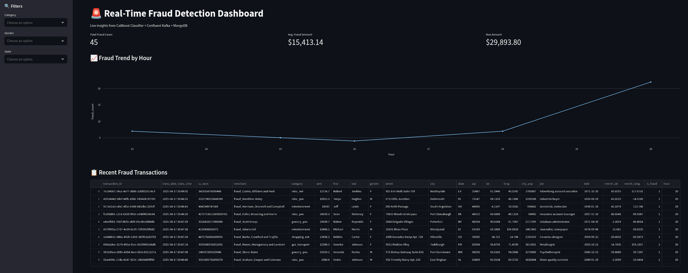
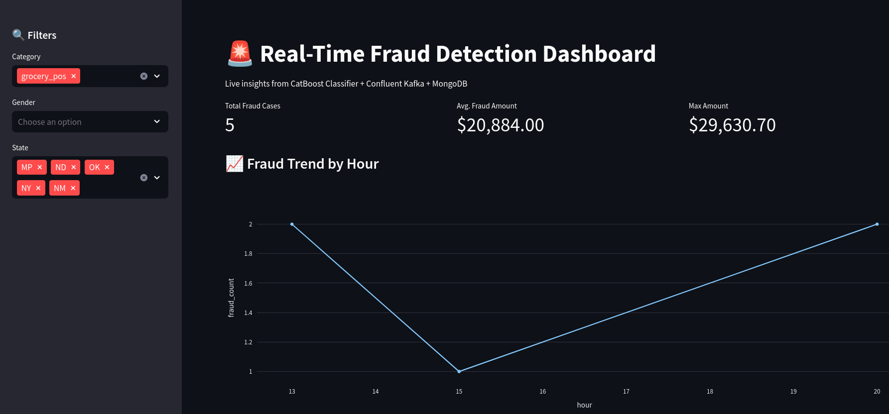
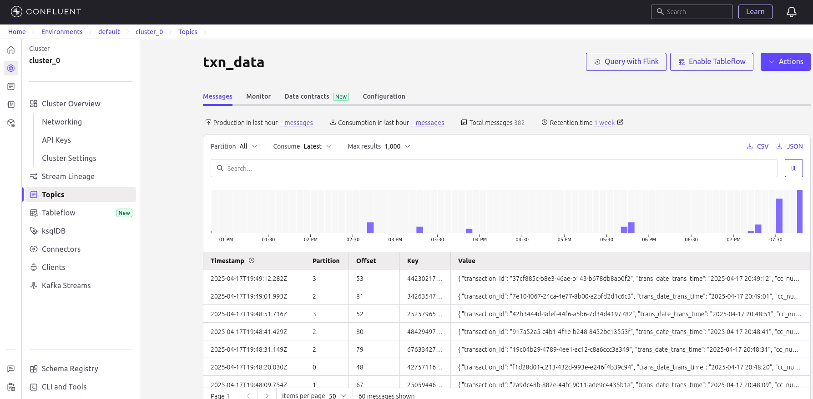
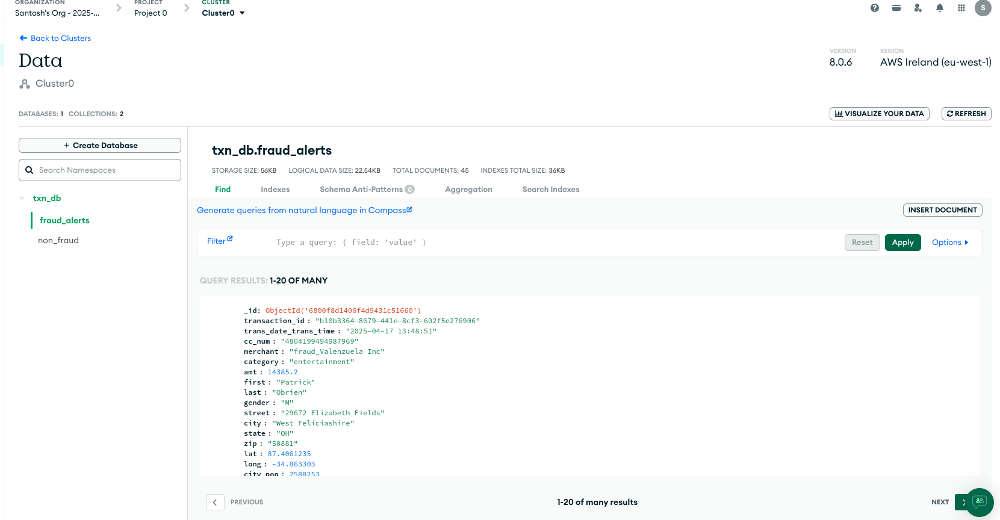
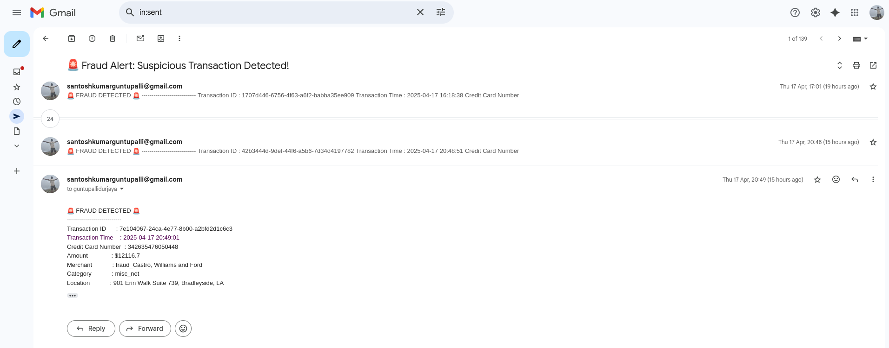
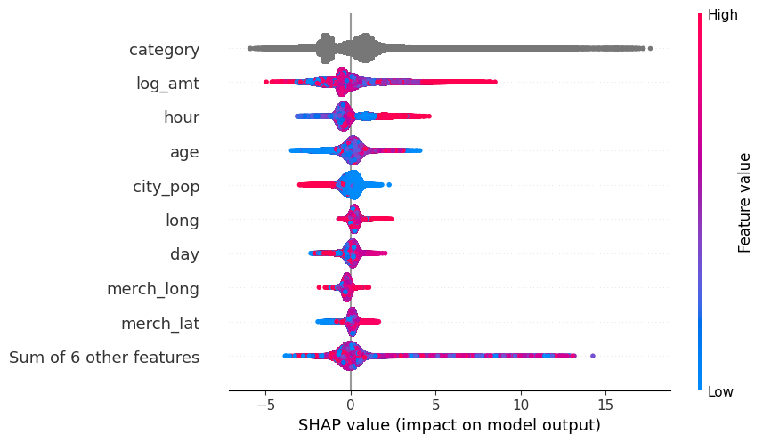
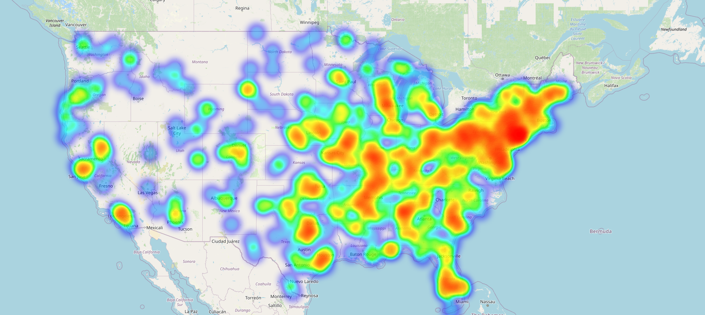

# Real-Time Credit Card Fraud Detection System
A real-time machine learning pipeline for detecting fraudulent credit card transactions using CatBoost, Kafka, MongoDB and Streamlit. This system leverages CatBoost classifier to detect fraudulent transactions as they occur. This model simulates streaming transactions using faker library, classifies them on-the-fly, provides an immediate email alert using SMTP PORT and SMTP SERVER, stores them in MongoDB and visualizes fraud patterns on a live dashboard.


[](https://www.python.org/)
[](https://kafka.apache.org/)
[](https://www.mongodb.com/)
[](https://catboost.ai/)
[](https://streamlit.io/)


🔗 **Live Streamlit App**: [Launch Dashboard](https://realtimecreditcardfrauddetectionsystem-csbhj8exeew6z7xew4g8xo.streamlit.app/)

---

## 📌 Table of Contents

- [📸 Demo Screenshots](#-demo-screenshots)
- [📁 Dataset](#-dataset)
- [📦 Features](#-features)
- [🧱 Project Architecture](#-project-architecture)
- [🚀 Getting Started](#-getting-started)
- [📊 Streamlit Dashboard](#-streamlit-dashboard)
- [🧠 Model & Evaluation](#-model--evaluation)
- [🔄 Streaming Pipeline](#-streaming-pipeline)
- [📁 Directory Structure](#-directory-structure)
- [🛠️ Tech Stack](#️-tech-stack)
- [📜 License](#-license)

---

## 📸 Demo Screenshots

> 🔻screenshots:
- Dashboard homepage



- Filter view



- Kafka stream logs



- Fraud and Non Fraud Database stored in MongoDB:



- Sample mail alerts sent:




---

## 📁 Dataset

The dataset used for training and evaluation is sourced from Hugging Face and contains synthetic credit card transaction data. Below are the key details:

    Source: The dataset is obtained from Hugging Face (dazzle-nu/CIS435-CreditCardFraudDetection).

    Features:
        cc_num: Credit card number.
        amt: Transaction amount.
        trans_date_trans_time: Date and time of the transaction.
        dob: Date of birth of the cardholder.
        lat and long: Latitude and longitude of the transaction location.
        merch_lat and merch_long: Latitude and longitude of the merchant location.
        is_fraud: Binary target variable indicating whether the transaction is fraudulent (1 for fraud, 0 for legitimate).

    Preprocessing:
        The dataset undergoes several preprocessing steps, including handling missing values, converting data types, and creating new features such as age, is_large_transaction, and log_amt.
        The trans_date_trans_time and dob are converted to datetime formats.
        The distance_km feature is calculated using the Haversine distance formula to determine the distance between the customer and merchant locations.
        The is_large_transaction feature is created to indicate transactions exceeding a certain amount threshold.
        The log_amt feature is the logarithmic transformation of the transaction amount to handle skewness.

This dataset is well-suited for training a fraud detection model due to its comprehensive feature set and realistic transaction scenarios.

---

## 📦 Features

✅ Real-time transaction simulation using **Faker**  
✅ Kafka Producer + Consumer for streaming pipeline  
✅ Feature engineering and transformation logic  
✅ **CatBoostClassifier** for high-performance fraud detection  
✅ **SHAP** visualizations for model explainability  
✅ MongoDB integration for storing flagged transactions  
✅ Live, interactive dashboard built with **Streamlit**  
✅ Email alerts for fraudulent activity  
✅ Fully modular and production-style architecture

---

## 🧱 Project Architecture

```text
[Kafka Producer] ---> [Kafka Broker] ---> [Kafka Consumer]
         |                                    |
     [Faker Txn]                         [Feature Transformer]
                                              |
                                       [CatBoost Model]
                                              |
                                 [MongoDB: fraud_alerts / non_fraud]
                                              |
                                      [Streamlit Dashboard + Alerting]
```

---

## 🚀 Getting Started

### 🔧 Prerequisites

- Python 3.10+
- Kafka Cluster (e.g., Confluent Cloud or local)
- MongoDB Instance (Cloud or local)

### 📥 Clone the Repository

```bash
git clone https://github.com/your-username/Real_Time_Credit_Card_Fraud_Detection_System.git
cd Real_Time_Credit_Card_Fraud_Detection_System
```

### 📦 Install Requirements

```bash
pip install -r requirements.txt
```

### 🔐 Setup `.env`

```env
KAFKA_BOOTSTRAP_SERVERS=your_kafka_server
KAFKA_USERNAME=your_kafka_username
KAFKA_PASSWORD=your_kafka_password
MONGO_URI=your_mongodb_connection_string
SMTP_SERVER=smtp.yourmail.com
SMTP_PORT=587
EMAIL_SENDER=your_email@example.com
EMAIL_PASSWORD=your_email_password
EMAIL_RECEIVER=receiver_email@example.com
```

---

## 📊 Streamlit Dashboard

Launch the dashboard to view fraud patterns in real-time:

```bash
streamlit run app.py
```

Or open directly:
👉 [realtimecreditcardfrauddetectionsystem.streamlit.app](https://realtimecreditcardfrauddetectionsystem-csbhj8exeew6z7xew4g8xo.streamlit.app/)

---

## 🔄Training Pipeline

Run the training pipeline:

```bash
python fraud_detection/pipeline/training_pipeline.py
```
or

```bash
python main.py
```

This will execute the following steps:

Ingest data
Validate data
Engineer features
Train the model
Evaluate the model

---

## 🧠 Model & Evaluation

- Model: `CatBoostClassifier`
- Evaluation Metrics:
  - **Accuracy**: 99.94%
  - **ROC AUC**: 99.94%
  - **Log Loss**: 0.0020

- SHAP-based interpretability with feature importance ranking



- Geographical heatmap of fraud transactions by location generated using folium maps




📂 Outputs:
- `trained_model.cbm`
- `evaluation_metrics.csv`
- `shap_values.pkl`

---

## 🔄 Streaming Pipeline

Run the full pipeline:

```bash
python fraud_detection/pipeline/streaming_pipeline.py
```

This runs:
- `kafka_producer` → Sends transactions
- `kafka_consumer` → Classifies and stores transactions
- `alerting` → Sends email for frauds

---

## 📁 Directory Structure

```bash
.
├── app.py                      # Streamlit-based dashboard
├── artifacts/                 # Project artifacts
│   ├── dataset/               # Raw and processed datasets
│   ├── engineered_data/        # Feature-engineered data
│   └── reports/                # Evaluation reports and SHAP values
├── build/                      # Build directory
├── catboost_info/               # CatBoost training information
├── config/                     # Configuration files
├── dist/                       # Distribution package
├── fraud_detection/             # Core project package
│   ├── components/             # Pipeline components
│   │   ├── stage_00_data_ingestion.py  # Data ingestion
│   │   ├── stage_01_data_validation.py # Data validation
│   │   ├── stage_02_feature_engineering.py # Feature engineering
│   │   ├── stage_03_model_training.py    # Model training
│   │   └── stage_04_model_evaluation.py # Model evaluation
│   ├── config/                 # Configuration files
│   ├── constant/               # Project constants
│   ├── data_generator/         # Data generation utilities
│   ├── entity/                 # Entity classes
│   ├── exception/               # Custom exceptions
│   ├── logger/                  # Logging utilities
│   ├── pipeline/               # Training and streaming pipelines
│   ├── streaming/              # Streaming components
│   └── utils/                 # Utility functions
├── logs/                       # Log files
├── main.py                     # Main execution file
├── README.md                    # This file
├── requirements.txt           # Project dependencies
├── research/                    # Research and experimentation
├── saved_models/               # Trained models
├── schema.yaml                 # Data schema
├── setup.py                    # Setup file
└── template.py                  # Template file\

```

---

## 🛠️ Tech Stack

| Component       | Tool/Library                    |
|----------------|----------------------------------|
| ML Model       | CatBoost                        |
| Stream         | Kafka + Confluent               |
| Data Sim       | Faker                            |
| Dashboard      | Streamlit + Plotly              |
| Storage        | MongoDB                         |
| Geo Analysis   | Geopy                            |
| Email Alerts   | SMTP                             |
| Explainability | SHAP                             |
| Packaging      | YAML, Python-dotenv             |

---

## 📜 License

This project is licensed under the Apache 2.0 License.  
Feel free to use, contribute, or fork!

---

## 🙌 Acknowledgements

- Thanks to **CatBoost** for blazing-fast tree boosting
- Thanks to **Streamlit** for effortless dashboards
- Inspired by real-world streaming data and fraud challenges

---

## 📬 Contact

Santosh Kumar Guntupalli
[GitHub](https://github.com/santosh3110) | [LinkedIn](https://www.linkedin.com/in/santosh-guntupalli-05b285250/)
